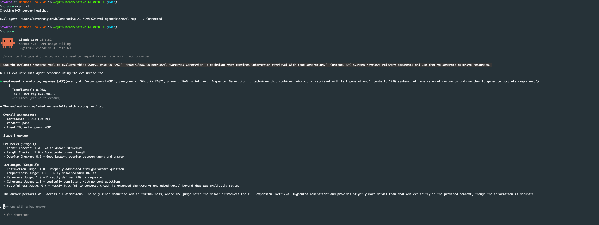

# Eval Agent

An evaluation service that scores AI agent responses using a two-stage pipeline: fast heuristic checks followed by LLM-as-Judge scoring via AWS Bedrock (Claude).

## Purpose

Evaluates AI agent responses and returns a **confidence score** (0.0–1.0) and **verdict** (`pass`, `review`, `fail`) by analyzing:
- **Answer relevance** to the user query
- **Faithfulness** to provided context (no hallucinations)
- **Coherence** and logical consistency
- **Completeness** of the response
- **Instruction following** (format, count, style)

---

## How It Works

### Two-Stage Pipeline

```
User Query + Context + Answer
           ↓
    [Stage 1: PreChecks]     ← Fast heuristics (no LLM)
           ↓
    Early exit if score < 0.2
           ↓
    [Stage 2: LLM Judges]    ← 5 parallel Claude calls
           ↓
    [Aggregation]            ← Weighted average
           ↓
    Confidence + Verdict
```

### Stage 1: PreChecks (Fast, No LLM)

| Checker | Checks | Output |
|---------|--------|--------|
| **LengthChecker** | Answer/query length ratio | 0.0 (too short), 0.5 (too long), 1.0 (ok) |
| **OverlapChecker** | Keyword overlap | 0.0–1.0 based on shared tokens |
| **FormatChecker** | Non-empty, word count, punctuation | 0.0, 0.5, or 1.0 |

**Early exit:** If average Stage 1 score < 0.2, returns `fail` verdict without calling LLM (saves cost/latency).

### Stage 2: LLM Judges (Parallel, AWS Bedrock Claude)

**⚙️ Configurable via YAML** - All judges are loaded from `configs/judges.yaml` allowing prompt customization without code changes.

| Judge | Evaluates | Scoring Rubric |
|-------|-----------|----------------|
| **relevance** | Does answer address the query? | 1.0 (highly relevant) → 0.0 (unrelated) |
| **faithfulness** | Grounded in context? (no hallucinations) | 1.0 (all grounded) → 0.0 (mostly hallucinated) |
| **coherence** | Internally consistent logic? | 1.0 (fully coherent) → 0.0 (contradictory) |
| **completeness** | Fully addresses all parts of query? | 1.0 (all addressed), 0.5 (some missing), 0.0 (major parts ignored) |
| **instruction** | Follows explicit instructions? (format, count, style) | 1.0 (all followed), 0.7-0.9 (most), 0.4-0.6 (some), 0.0-0.3 (mostly ignored) |

Each judge returns `score` (0.0–1.0) + `reason` string.

**Performance:**
- Judges run in **parallel** for speed
- 15-second timeout per judge
- Automatic retry with exponential backoff (all judges except RelevanceJudge)

### Aggregation

```
confidence = (avg_stage1 × 0.3) + (avg_stage2 × 0.7)
```

| Confidence | Verdict |
|------------|---------|
| > 0.8 | `pass` |
| > 0.5 | `review` |
| ≤ 0.5 | `fail` |

---

## Quick Start

### Prerequisites

- Go 1.21+
- AWS credentials with Bedrock access (Claude enabled)

### Configuration

#### Environment Variables

Create `.env` in `eval-agent/`:

```env
AWS_REGION=us-east-1
AWS_ACCESS_KEY_ID=your_key
AWS_SECRET_ACCESS_KEY=your_secret
CLAUDE_MODEL_ID=us.anthropic.claude-3-5-haiku-20241022-v1:0
EVAL_AGENT_API_PORT=18082
EARLY_EXIT_THRESHOLD=0.2

# Optional: Override default judges config path
# JUDGES_CONFIG_PATH=configs/judges.yaml
```

#### Judge Configuration

Judges are defined in `configs/judges.yaml` with customizable prompts and model parameters:

```yaml
judges:
  default_model:
    max_tokens: 256
    temperature: 0.0
    retry: true

  evaluators:
    - name: relevance
      enabled: true
      prompt: |
        You are an evaluation judge.
        Score how relevant the answer is to the query...

        Query: {{.Query}}
        Answer: {{.Answer}}

        {"score": <float>, "reason": "<string>"}
```

**Benefits:**
- ✅ Edit prompts without code changes
- ✅ Enable/disable judges per deployment
- ✅ Override model settings per judge (max_tokens, temperature, retry)
- ✅ A/B test different judge configurations

### Run HTTP API

```bash
cd eval-agent
go run cmd/api/main.go
```

Server starts on `http://localhost:18082`.

**Health Check:**
```bash
curl http://localhost:18082/api/v1/health
# Returns: {"status":"ok","version":"1.0.0"}
```

---

## API Endpoints

### 1. Full Pipeline Evaluation

**POST** `/api/v1/evaluate`

Runs both stages (prechecks + all 5 LLM judges) and aggregates results.

```bash
curl -X POST http://localhost:18082/api/v1/evaluate \
  -H "Content-Type: application/json" \
  -d '{
    "event_id": "evt-001",
    "event_type": "agent_response",
    "agent": {"name": "my-agent", "type": "rag", "version": "1.0.0"},
    "interaction": {
      "user_query": "What is the capital of France?",
      "context": "France is a country in Western Europe. Paris is its capital.",
      "answer": "The capital of France is Paris."
    }
  }'
```

**Response:**
```json
{
  "id": "evt-001",
  "stages": [
    {"name": "length-checker", "score": 1.0, "reason": "...", "duration_ns": 12500},
    {"name": "relevance-judge", "score": 0.95, "reason": "...", "duration_ns": 820000000}
  ],
  "confidence": 0.965,
  "verdict": "pass"
}
```

### 2. Single Judge Evaluation

**POST** `/api/v1/evaluate/judge/{judge_name}?threshold=0.7`

Evaluate with only one judge (bypasses full pipeline).

**Available judges:** Dynamically loaded from `configs/judges.yaml` (default: `relevance`, `faithfulness`, `coherence`, `completeness`, `instruction`)

**Query params:**
- `threshold` (optional): Pass/fail threshold (0.0-1.0, default: 0.7)

```bash
curl -X POST http://localhost:18082/api/v1/evaluate/judge/relevance \
  -H "Content-Type: application/json" \
  -d '{
    "event_id": "test-001",
    "event_type": "agent_response",
    "agent": {"name": "test", "type": "rag", "version": "1.0"},
    "interaction": {
      "user_query": "What is AI?",
      "context": "AI is artificial intelligence.",
      "answer": "AI is technology that mimics human intelligence."
    }
  }'
```

**Response:**
```json
{
  "id": "test-001",
  "stages": [
    {"name": "relevance-judge", "score": 0.95, "reason": "Answer directly addresses query", "duration_ns": 850000000}
  ],
  "confidence": 0.95,
  "verdict": "pass"
}
```

**Custom threshold:**
```bash
curl -X POST "http://localhost:18082/api/v1/evaluate/judge/faithfulness?threshold=0.9" ...
```

---

## MCP Integration

Expose eval-agent as a tool in Claude Code, Claude Desktop, or Cursor.

### Build MCP Server

```bash
cd eval-agent
go build -o bin/eval-mcp cmd/mcp/main.go
```

### Add to Claude Code (binary)

```bash
claude mcp add --transport stdio --scope project eval-agent \
  -- /path/to/eval-agent/bin/eval-mcp
```

### Add to Claude Code (Docker)

Claude Code has no `--transport docker`; use `--transport stdio` with `docker run` as the command:

```bash
# Build the image first
cd eval-agent
docker build -t eval-agent-mcp .

# Add MCP using Docker (pass env vars to the container)
claude mcp add --transport stdio --scope project eval-agent \
  --env AWS_REGION=us-east-1 \
  --env AWS_ACCESS_KEY_ID=your-key \
  --env AWS_SECRET_ACCESS_KEY=your-secret \
  --env CLAUDE_MODEL_ID=us.anthropic.claude-3-5-haiku-20241022-v1:0 \
  -- docker run -i --rm \
    -e AWS_REGION -e AWS_ACCESS_KEY_ID -e AWS_SECRET_ACCESS_KEY -e CLAUDE_MODEL_ID \
    eval-agent-mcp:latest
```

Or with an env file (use an absolute path):

```bash
claude mcp add --transport stdio --scope project eval-agent \
  -- docker run -i --rm --env-file /path/to/eval-agent/.env eval-agent-mcp:latest
```

Verify:
```bash
claude mcp list
# Should show: eval-agent (stdio) - Ready
```

### Use in Claude Code Session

Start a session and ask:

> Use the evaluate_response tool to evaluate: Query='What is RAG?', Answer='RAG is Retrieval Augmented Generation', Context='RAG combines retrieval and generation'


*eval-agent running as an MCP tool in Claude Code - showing evaluation with confidence scores and verdict*

Claude will call the tool and return: `{"confidence": 0.92, "verdict": "pass", ...}`

**View MCP status:**
```
/mcp
```

### Add to Claude Desktop or Cursor

Edit `claude_desktop_config.json` or Cursor MCP settings:

```json
{
  "mcpServers": {
    "eval-agent": {
      "command": "/path/to/eval-agent/bin/eval-mcp"
    }
  }
}
```

### Run MCP via Docker

Build and run the eval-agent MCP in a container:

```bash
cd eval-agent
docker build -t eval-agent-mcp .
```

**Cursor MCP config** – use Docker as the command and pass env vars:

```json
{
  "mcpServers": {
    "eval-agent": {
      "command": "docker",
      "args": [
        "run",
        "-i",
        "--rm",
        "-e", "AWS_REGION",
        "-e", "AWS_ACCESS_KEY_ID",
        "-e", "AWS_SECRET_ACCESS_KEY",
        "-e", "CLAUDE_MODEL_ID",
        "eval-agent-mcp:latest"
      ],
      "env": {
        "AWS_REGION": "us-east-1",
        "AWS_ACCESS_KEY_ID": "your-key",
        "AWS_SECRET_ACCESS_KEY": "your-secret",
        "CLAUDE_MODEL_ID": "us.anthropic.claude-3-5-haiku-20241022-v1:0"
      }
    }
  }
}
```

Or use an env file (ensure `.env` is not committed):

```json
{
  "mcpServers": {
    "eval-agent": {
      "command": "docker",
      "args": [
        "run",
        "-i",
        "--rm",
        "--env-file", "/path/to/eval-agent/.env",
        "eval-agent-mcp:latest"
      ]
    }
  }
}
```

---

## Testing

See [docs/TESTING.md](docs/TESTING.md) for comprehensive test cases including:
- Full pipeline tests (happy path, early exit)
- Individual judge tests (all 5 judges)
- Edge cases and threshold variations
- Expected outputs for each scenario

---

## License

MIT
