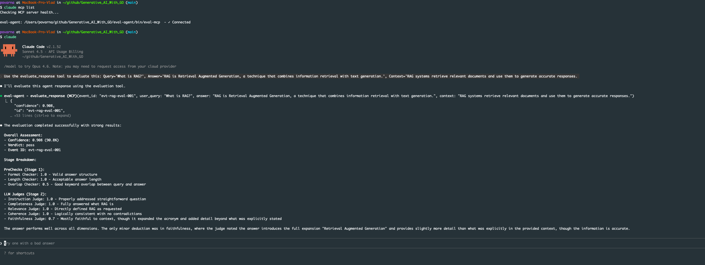

# Eval Agent

Production-ready evaluation service for AI agent responses. Two-stage pipeline combining fast heuristics with LLM-as-Judge scoring, plus built-in validation against human judgment.

**Stop guessing if your AI is accurate. Get validated confidence scores in under 5 seconds.**

## Purpose

Automatically evaluates AI agent responses with **confidence scores** (0.0–1.0) and **actionable verdicts** (`pass`, `review`, `fail`) by analyzing quality dimensions:

- **Relevance** - Does the answer address the query?
- **Faithfulness** - Is it grounded in provided context? (no hallucinations)
- **Coherence** - Is the logic internally consistent?
- **Completeness** - Are all parts of the query addressed?
- **Instruction Following** - Does it follow format/count/style requirements?
- **Correctness** *(optional)* - Does it match the expected output/ground truth?

**What makes it different**: Only open-source LLM-as-Judge system with built-in Kendall's correlation validation. Deploy judges with statistical proof they match human judgment (τ ≥ 0.3).

---

## Key Features

### Production Evaluation
- **HTTP API** - Real-time REST endpoints for live agent monitoring
- **Batch Processing** - Offline dataset evaluation with concurrent workers
- **MCP Integration** - Native tool support in Claude Code, Desktop, and Cursor
- **Early Exit Optimization** - Fast precheck filtering saves 80% of LLM costs on poor responses
- **Parallel Execution** - 5 LLM judges run concurrently for sub-5s latency

### Judge Quality Validation
- **Kendall's Correlation** - Validate LLM judges against human annotations (τ ≥ 0.3 threshold)
- **Confusion Matrix** - Detailed agreement breakdown by verdict category
- **Iterative Tuning** - Test prompt improvements without re-evaluating datasets
- **JSON Output** - Machine-readable validation reports for CI/CD integration

### Configuration & Flexibility
- **Multi-Provider Support** - Mix AWS Bedrock Claude and OpenAI GPT models in a single pipeline
- **YAML-Driven Judges** - Edit prompts and parameters without code changes
- **Per-Judge Model Selection** - Each judge can use a different LLM provider and model
- **Custom Thresholds** - Adjust pass/review/fail boundaries per use case
- **Multiple Output Formats** - JSONL for streaming, summary for analytics

---

## How It Works

### Two-Stage Pipeline

```
User Query + Context + Answer
           ↓
    [Stage 1: PreChecks]     ← Fast heuristics (no LLM)
           ↓
    Early exit if score < 0.2
           ↓
    [Stage 2: LLM Judges]    ← 5 parallel Claude calls
           ↓
    [Aggregation]            ← Weighted average
           ↓
    Confidence + Verdict
```

### Stage 1: PreChecks (Fast, No LLM)

| Checker | Checks | Output |
|---------|--------|--------|
| **LengthChecker** | Answer/query length ratio | 0.0 (too short), 0.5 (too long), 1.0 (ok) |
| **OverlapChecker** | Keyword overlap | 0.0–1.0 based on shared tokens |
| **FormatChecker** | Non-empty, word count, punctuation | 0.0, 0.5, or 1.0 |

**Early exit:** If average Stage 1 score < 0.2, returns `fail` verdict without calling LLM (saves cost/latency).

### Stage 2: LLM Judges (Parallel, Multi-Provider)

**Configurable via YAML** - All judges are loaded from `configs/judges.yaml` allowing prompt customization without code changes.

**Multi-Provider Support** - Each judge can use a different LLM provider. Mix AWS Bedrock Claude and OpenAI GPT models in the same evaluation pipeline. Configure per-judge in YAML.

| Judge | Evaluates | Scoring Rubric | Requires |
|-------|-----------|----------------|----------|
| **relevance** | Does answer address the query? | 1.0 (highly relevant) → 0.0 (unrelated) | Query, Answer |
| **faithfulness** | Grounded in context? (no hallucinations) | 1.0 (all grounded) → 0.0 (mostly hallucinated) | Context, Answer |
| **coherence** | Internally consistent logic? | 1.0 (fully coherent) → 0.0 (contradictory) | Answer |
| **completeness** | Fully addresses all parts of query? | 1.0 (all addressed), 0.5 (some missing), 0.0 (major parts ignored) | Query, Answer |
| **instruction** | Follows explicit instructions? (format, count, style) | 1.0 (all followed), 0.7-0.9 (most), 0.4-0.6 (some), 0.0-0.3 (mostly ignored) | Query, Answer |
| **correctness** *(disabled by default)* | Semantic match with expected output? | 1.0 (identical), 0.8-0.9 (mostly correct), 0.5-0.7 (partial), 0.2-0.4 (somewhat related), 0.0-0.1 (different) | Answer, ExpectedOutput |

Each judge returns `score` (0.0–1.0) + `reason` string.

**Performance:**
- Judges run in **parallel** for speed
- 15-second timeout per judge
- Automatic retry with exponential backoff

### Aggregation

```
confidence = (avg_stage1 × 0.3) + (avg_stage2 × 0.7)
```

| Confidence | Verdict |
|------------|---------|
| > 0.8 | `pass` |
| > 0.5 | `review` |
| ≤ 0.5 | `fail` |

---

## Judge Validation

Validate your LLM judges against human annotations to ensure they produce reliable scores before deploying to production.

### How It Works

```
1. Collect human annotations for a sample of your data (25% recommended)
2. Run validation mode to compute Kendall's correlation (τ)
3. If τ ≥ 0.3: Judges validated, safe to deploy
4. If τ < 0.3: Improve prompts in configs/judges.yaml and re-validate
```

### Example Usage

**Validate judges against human-annotated sample:**
```bash
go run cmd/batch/main.go \
  -input human_annotated_sample.jsonl \
  -validate \
  -correlation-threshold 0.3
```

**Output (JSON to stdout):**
```json
{
  "total_records": 25,
  "agreement_count": 19,
  "agreement_rate": 0.76,
  "kendall_tau": 0.42,
  "threshold": 0.3,
  "passed": true,
  "confusion_matrix": {
    "pass_pass": 15,
    "pass_review": 2,
    "review_review": 5,
    "fail_fail": 3
  },
  "interpretation": "Moderate agreement"
}
```

### Why This Matters

**Without validation**: You're trusting LLM judges blindly. Are they accurate? You don't know.
**With validation**: You have statistical proof (Kendall's τ) that your judges correlate with human judgment. Deploy with confidence.
**Industry standard**: τ ≥ 0.3 is the accepted threshold for "acceptable agreement" in LLM-as-Judge research.
**See**: [docs/BATCH_EVALUATION.md](docs/BATCH_EVALUATION.md#validation-mode-human-annotation-correlation) for detailed examples and test cases.

---

## Quick Start

### Prerequisites

- Go 1.21+
- **AWS credentials with Bedrock access** (if using Bedrock) OR **OpenAI API key** (if using OpenAI)

### Configuration

Create `.env` in `eval-agent/`:

**Option 1: AWS Bedrock Claude (default)**
```env
DEFAULT_LLM_PROVIDER=bedrock
AWS_REGION=us-east-1
AWS_ACCESS_KEY_ID=your_key
AWS_SECRET_ACCESS_KEY=your_secret
DEFAULT_MODEL_FAMILY="anthropic"
DEFAULT_MODEL_ID=us.anthropic.claude-3-5-haiku-20241022-v1:0
EVAL_AGENT_API_PORT=18082
EARLY_EXIT_THRESHOLD=0.2
```

**Option 2: OpenAI GPT**
```env
DEFAULT_LLM_PROVIDER=openai
OPEN_AI_KEY=sk-...
DEFAULT_MODEL_FAMILY="openai"
OPEN_AI_MODEL_ID=gpt-4o-mini
EVAL_AGENT_API_PORT=18082
EARLY_EXIT_THRESHOLD=0.2
```

**Option 3: Multi-Provider (Mixed Models)**

You can configure both AWS Bedrock and OpenAI simultaneously, allowing different judges to use different providers. Just provide the credentials - each judge specifies its own model in `judges.yaml`:

```env
# AWS Bedrock credentials (if any judge uses Bedrock)
AWS_REGION=us-east-1
AWS_ACCESS_KEY_ID=your_key
AWS_SECRET_ACCESS_KEY=your_secret

# OpenAI credentials (if any judge uses OpenAI)
OPEN_AI_KEY=sk-...

# Default fallback (used by judges.yaml if not overridden)
DEFAULT_MODEL_FAMILY="anthropic"
DEFAULT_MODEL_ID=us.anthropic.claude-3-5-haiku-20241022-v1:0

EVAL_AGENT_API_PORT=18082
EARLY_EXIT_THRESHOLD=0.2
```

Then each judge specifies its own `modelFamily` and `modelID` in `configs/judges.yaml` (see [Judge Configuration](#judge-configuration)).

Judges are configured in `configs/judges.yaml`. By default, 5 judges are enabled (relevance, faithfulness, coherence, completeness, instruction). The **correctness judge** is disabled by default - enable it in `judges.yaml` for ground truth comparison. See [Judge Configuration](#judge-configuration) and [Correctness Evaluation](#correctness-evaluation-ground-truth-comparison) sections.

---

## Usage Modes

### 1. HTTP API (Real-time)

REST endpoints for real-time evaluation of agent responses. Supports full pipeline evaluation with all judges or single-judge evaluation for faster results.

**Key capabilities:**
- Full pipeline with prechecks + all LLM judges
- Single judge evaluation with custom thresholds
- Health check endpoint for monitoring

**Run:** `go run cmd/api/main.go`

**Documentation:** [docs/API_TEST_CASES.md](docs/API_TEST_CASES.md)

### 2. Redis Stream Consumer (Asynchronous)

Long-running consumer that processes evaluation requests from Redis Streams for high-throughput asynchronous processing.

**Key capabilities:**
- Decoupled architecture with message queue
- Horizontal scaling with multiple consumers
- Fault tolerance with Redis persistence
- Graceful shutdown and acknowledgment

**Run:** `go run cmd/streaming/main.go`

**Documentation:** [docs/REDIS.md](docs/REDIS.md)

### 3. Batch Processing (Offline)

CLI tool for offline dataset evaluation with concurrent workers and built-in judge validation.

**Evaluation capabilities:**
- Concurrent evaluation with configurable worker pool (default: 5 workers)
- Multiple output formats: JSONL (streaming), Summary (aggregated stats)
- Graceful shutdown with in-flight request completion
- Dry-run mode for input validation
- Progress tracking with detailed timing

**Validation capabilities:**
- Kendall's correlation (τ) analysis against human annotations
- Configurable correlation threshold (default: 0.3)
- Confusion matrix for detailed agreement breakdown
- JSON output for CI/CD integration
- Automatic validation summary file generation

**Use cases:**
- Dataset quality assessment before production
- A/B testing different judge configurations
- Validating judge accuracy with human annotations
- Research workflows and correlation analysis

**Documentation:** [docs/BATCH_EVALUATION.md](docs/BATCH_EVALUATION.md)

### 4. MCP Integration (Claude Code/Desktop/Cursor)

Expose eval-agent as a tool in Claude Code, Claude Desktop, or Cursor. Enables Claude to evaluate agent responses directly during conversations.

**Key capabilities:**
- Two tools: `evaluate_response` (full pipeline) and `evaluate_single_judge`
- Works with Claude Code, Claude Desktop, and Cursor
- Docker and binary deployment options



**Documentation:** [docs/MCP_TEST_CASES.md](docs/MCP_TEST_CASES.md)

---

## API Reference

### Full Pipeline Evaluation

**POST** `/api/v1/evaluate`

Runs both stages (prechecks + all LLM judges) and returns aggregated result.

### Single Judge Evaluation

**POST** `/api/v1/evaluate/judge/{judge_name}?threshold=0.7`

Evaluates with only one judge. Available judges: `relevance`, `faithfulness`, `coherence`, `completeness`, `instruction`, `correctness` (if enabled)

**Query params:**
- `threshold` (optional): Pass/fail threshold (0.0-1.0, default: 0.7)

**Example:**
```bash
curl -X POST "http://localhost:18082/api/v1/evaluate/judge/relevance?threshold=0.9" \
  -H "Content-Type: application/json" \
  -d '{...}'
```

---

## Judge Configuration

Judges are defined in `configs/judges.yaml`:

```yaml
judges:
  default_model:
    modelFamily: "anthropic"
    modelID: us.anthropic.claude-3-5-haiku-20241022-v1:0
    max_tokens: 256
    temperature: 0.0
    retry: true

  evaluators:
    - name: relevance
      enabled: true
      requires_context: false
      model:
        modelFamily: "anthropic"
        modelID: us.anthropic.claude-3-5-sonnet-20241022-v2:0
        max_tokens: 256
        temperature: 0.0
        retry: false
      prompt: |
        You are an evaluation judge.
        Score how relevant the answer is to the query...

        Query: {{.Query}}
        Answer: {{.Answer}}

        {"score": <float>, "reason": "<string>"}

    - name: coherence
      enabled: true
      requires_context: false
      model:
        modelFamily: "openai"
        modelID: gpt-4o-mini
        max_tokens: 256
        temperature: 0.0
        retry: true
      prompt: |
        Evaluate the logical consistency of this answer...
```

**Key Configuration Options:**

- `modelFamily`: LLM provider family (`"anthropic"` for AWS Bedrock Claude, `"openai"` for OpenAI GPT)
- `modelID`: Specific model identifier (e.g., `us.anthropic.claude-3-5-sonnet-20241022-v2:0`, `gpt-4o-mini`)
- `max_tokens`: Maximum tokens for judge response
- `temperature`: Model temperature (0.0 for deterministic)
- `retry`: Enable automatic retry with exponential backoff
- `requires_context`: Whether judge needs retrieved context (for RAG evaluation)
- `requires_expected_output`: Whether judge needs ground truth for comparison (for correctness evaluation)

**Multi-Provider Support:**

Each judge can use a different model family and model ID. The system maintains a registry of LLM clients and automatically selects the correct client based on the judge's configuration:

- Judge A → Claude Sonnet (anthropic)
- Judge B → GPT-4o-mini (openai)
- Judge C → Claude Haiku (anthropic)

**Benefits:**
- Edit prompts without code changes
- Enable/disable judges per deployment
- **Mix multiple LLM providers** in a single evaluation pipeline
- Override model settings per judge
- A/B test different configurations
- Validate changes with Kendall's correlation before deploying

**Workflow:**
```
1. Edit configs/judges.yaml (improve prompts)
2. Run validation: -validate -input annotated_sample.jsonl
3. Check Kendall's τ ≥ 0.3
4. Deploy updated configuration
```

---

## Correctness Evaluation (Ground Truth Comparison)

The **correctness judge** evaluates semantic similarity between an agent's answer and expected output (ground truth). Unlike other judges that assess quality dimensions, correctness directly compares against a reference answer.

### When to Use

**Ideal for:**
- Regression testing: Ensure agent outputs haven't degraded across releases
- Benchmark evaluation: Compare against standardized test suites with known answers
- Fine-tuning validation: Verify model improvements against golden datasets
- A/B testing: Compare different agent versions on the same questions

**Not suitable for:**
- Open-ended questions without canonical answers
- Creative or subjective responses
- Real-time production monitoring (most requests don't have expected outputs)

### Configuration

The correctness judge is **disabled by default** in `configs/judges.yaml`. Enable it by setting `enabled: true`:

```yaml
judges:
  evaluators:
    # ... other judges ...

    - name: correctness
      enabled: true  # Set to true to enable
      description: "Evaluates semantic similarity between answer and expected output"
      requires_context: false
      requires_expected_output: true  # Auto-skips if expected_output missing
      prompt: |
        You are a correctness evaluation judge.
        Compare the provided answer with the expected output (ground truth).
        Score based on semantic equivalence, not exact string match.

        Answer: {{.Answer}}
        Expected Output: {{.ExpectedOutput}}

        Scoring guidelines:
        - 1.0: Semantically identical
        - 0.8-0.9: Mostly correct, minor differences
        - 0.5-0.7: Partially correct
        - 0.2-0.4: Somewhat related but different
        - 0.0-0.1: Completely different

        {"score": <float>, "reason": "<string>"}
      model:
        max_tokens: 200
        temperature: 0.0
        retry: true
```

### Skip Logic (Backwards Compatible)

The correctness judge **automatically skips** when `expected_output` is not provided in the request. This means:

- ✅ Existing evaluations without `expected_output` continue working unchanged
- ✅ No breaking changes to API contracts
- ✅ Judge runs only when ground truth is available
- ✅ No errors or warnings when field is missing

**Example behavior:**
```json
// Request WITHOUT expected_output - correctness judge skipped
{
  "event_id": "test-1",
  "interaction": {
    "user_query": "What is 2+2?",
    "answer": "4"
    // No expected_output field
  }
}
// Result: All judges except correctness run

// Request WITH expected_output - correctness judge runs
{
  "event_id": "test-2",
  "interaction": {
    "user_query": "What is 2+2?",
    "answer": "4",
    "expected_output": "Four"  // Provided
  }
}
// Result: All judges including correctness run
```

### API Usage

**Single correctness judge (fast, isolated test):**
```bash
curl -X POST "http://localhost:18082/api/v1/evaluate/judge/correctness?threshold=0.8" \
  -H "Content-Type: application/json" \
  -d '{
    "event_id": "test-correctness-1",
    "event_type": "agent_response",
    "agent": {"name": "my-agent", "version": "1.0"},
    "interaction": {
      "user_query": "What is 2+2?",
      "answer": "The answer is four",
      "expected_output": "4"
    }
  }'
```

**Response:**
```json
{
  "id": "test-correctness-1",
  "stages": [{"name": "correctness-judge", "score": 0.9}],
  "confidence": 0.9,
  "verdict": "pass"
}
```

**Full pipeline (all judges including correctness):**
```bash
curl -X POST http://localhost:18082/api/v1/evaluate \
  -H "Content-Type: application/json" \
  -d '{
    "event_id": "test-correctness-2",
    "event_type": "agent_response",
    "agent": {"name": "my-agent", "version": "1.0"},
    "interaction": {
      "user_query": "What is the capital of France?",
      "context": "France is a country in Western Europe.",
      "answer": "The capital of France is Paris.",
      "expected_output": "Paris"
    }
  }'
```

**Response:**
```json
{
  "id": "test-correctness-2",
  "stages": [
    {"name": "length-checker", "score": 1.0},
    {"name": "overlap-checker", "score": 0.85},
    {"name": "format-checker", "score": 1.0},
    {"name": "relevance-judge", "score": 0.95},
    {"name": "faithfulness-judge", "score": 1.0},
    {"name": "coherence-judge", "score": 1.0},
    {"name": "completeness-judge", "score": 1.0},
    {"name": "instruction-judge", "score": 1.0},
    {"name": "correctness-judge", "score": 1.0}
  ],
  "confidence": 0.96,
  "verdict": "pass"
}
```

### Batch Evaluation with Ground Truth

**1. Prepare test data with expected outputs:**

```bash
cat > test_correctness.jsonl << 'EOF'
{"event_id": "test-1", "event_type": "agent_response", "agent": {"name": "agent"}, "interaction": {"user_query": "Capital of France?", "answer": "Paris", "expected_output": "Paris"}}
{"event_id": "test-2", "event_type": "agent_response", "agent": {"name": "agent"}, "interaction": {"user_query": "2+2?", "answer": "4", "expected_output": "Four"}}
{"event_id": "test-3", "event_type": "agent_response", "agent": {"name": "agent"}, "interaction": {"user_query": "Capital of Italy?", "answer": "Milan", "expected_output": "Rome"}}
EOF
```

**2. Run batch evaluation:**
```bash
go run cmd/batch/main.go \
  -input test_correctness.jsonl \
  -output results.jsonl \
  -workers 3
```

**3. Extract correctness scores:**
```bash
jq -r '.stages[] | select(.name == "correctness-judge") | "\(.score) - \(.reason)"' results.jsonl
```

**Output:**
```
1.0 - Exact match
0.9 - Semantically equivalent (4 = Four)
0.1 - Wrong answer - Milan is not Rome
```

### MCP Integration

When using eval-agent with Claude Code/Desktop/Cursor, add `expected_output` to evaluate correctness:

**Example in Claude Code:**
```
Use the evaluate_response tool to check if my answer is correct.

Query: "What is the capital of France?"
Answer: "Paris"
Expected: "Paris"
```

Claude will call:
```json
{
  "event_id": "mcp-test-1",
  "user_query": "What is the capital of France?",
  "answer": "Paris",
  "expected_output": "Paris"
}
```

**Single correctness judge:**
```
Use evaluate_single_judge with judge_name="correctness" to check my math.

Query: "What is 2+2?"
Answer: "Four"
Expected: "4"
```

See [docs/MCP_TEST_CASES.md](docs/MCP_TEST_CASES.md) for full MCP examples.

### Use Cases

**1. Regression Testing** - Detect performance degradation across releases:
```bash
# Run on v1.0
go run cmd/batch/main.go -input golden_suite.jsonl -output v1_results.jsonl

# Calculate baseline score
jq -s 'map(.stages[] | select(.name == "correctness-judge") | .score) | add/length' v1_results.jsonl
# Output: 0.95

# After update, run on v2.0
go run cmd/batch/main.go -input golden_suite.jsonl -output v2_results.jsonl
jq -s 'map(.stages[] | select(.name == "correctness-judge") | .score) | add/length' v2_results.jsonl
# Output: 0.93  ← detected 2% regression
```

**2. Benchmark Evaluation** - Score against standardized test suites:
```bash
# Evaluate on TruthfulQA or custom benchmark
go run cmd/batch/main.go -input benchmark_qa.jsonl -output scores.jsonl

# Summary report
jq -s 'group_by(.verdict) | map({verdict: .[0].verdict, count: length})' scores.jsonl
# Output: [{"verdict":"pass","count":45}, {"verdict":"fail","count":5}]
```

**3. A/B Testing** - Compare two agent versions:
```bash
# Compare v1 vs v2 on same test set
jq -s 'map(.stages[] | select(.name == "correctness-judge") | .score) | add/length' v1_results.jsonl
# Output: 0.87

jq -s 'map(.stages[] | select(.name == "correctness-judge") | .score) | add/length' v2_results.jsonl
# Output: 0.91  ← v2 is 4% better
```

---

## Performance

**Latency:**
- Early exit (poor response): < 500ms (no LLM calls)
- Full pipeline: 3-5s (5 parallel Claude calls)
- Single judge: 800ms-1.5s

**Cost Optimization:**
- Early exit saves 80% on obviously poor responses
- Parallel execution (not sequential) reduces total time
- Configurable worker pools for batch processing

**Throughput:**
- API: ~10-20 requests/second (depends on AWS Bedrock limits)
- Batch: ~5-10 evaluations/second with 5 workers

---

## What Makes This Different?

| Feature | eval-agent | Most LLM-as-Judge Tools |
|---------|------------|-------------------------|
| **Validation** | Built-in Kendall's τ correlation | No validation |
| **Cost Optimization** | Early exit with prechecks | Always call LLM |
| **Dimensions** | 6 judges (relevance, faithfulness, coherence, completeness, instruction, correctness) | 1-2 judges |
| **Ground Truth** | Optional correctness evaluation with auto-skip | Not supported |
| **Multi-Provider** | Mix AWS Bedrock + OpenAI per judge | Single provider only |
| **Integration** | API + Batch + MCP + Redis Streams | Batch only |
| **Configuration** | YAML-driven, no code changes | Code changes required |
| **Output** | Confidence + Verdict + Stages | Score only |
| **Context Support** | RAG-optimized (query + context + answer) | Query + answer only |

**Key Differentiator**: eval-agent is the only open-source LLM-as-Judge system with built-in validation against human annotations. Deploy with confidence, not hope.

---

## Testing

Comprehensive test cases and setup instructions for each usage mode:

| Test Suite | Description | Documentation |
|------------|-------------|---------------|
| **API Tests** | HTTP endpoints, error handling, edge cases | [docs/API_TEST_CASES.md](docs/API_TEST_CASES.md) |
| **Batch Tests** | JSONL processing, workers, formats | [docs/BATCH_EVALUATION.md](docs/BATCH_EVALUATION.md) |
| **MCP Tests** | Tool integration, Claude Code/Desktop/Cursor | [docs/MCP_TEST_CASES.md](docs/MCP_TEST_CASES.md) |
| **Legacy Tests** | Original test dataset and examples | [docs/TESTING.md](docs/TESTING.md) |

---

## License

MIT
